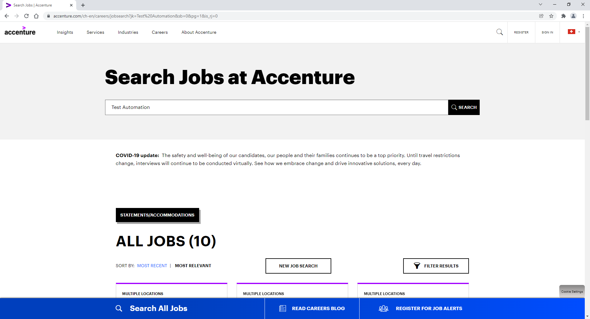

# **Playwright and Jest Homework**
## **Preconditions**
1. [IDE ](https://rit.accenture.com/ies-confluence/display/STA/How+to+setup+workspace+locally#:~:text=Installing%20an%20IDE%2C%20in%20our%20case%20Visual%20Studio%20Code.)is installed and ready to be used on your machine
1. Jest has been installed.
1. Playwright has been installed.
## **Implement the Search Jobs flow**
1. ##### **Open [https://www.accenture.com**](https://www.accenture.com/ch-en)**

##### **2. Click on "Careers" and then on "Search and Apply"**

##### **3. Enter "Test Automation" in the search bar and press Enter**

##### **4. Click on "FILTER RESULTS", insert the given filter and click on the 'Update' button**

##### **5. Verify that the 'LUGANO' tag is present on top of results and verify that it contains the proper text**

##### **6. Open the first job description that appears**

##### **7. Verify that the 'Locations' field contains the text 'Lugano'**

